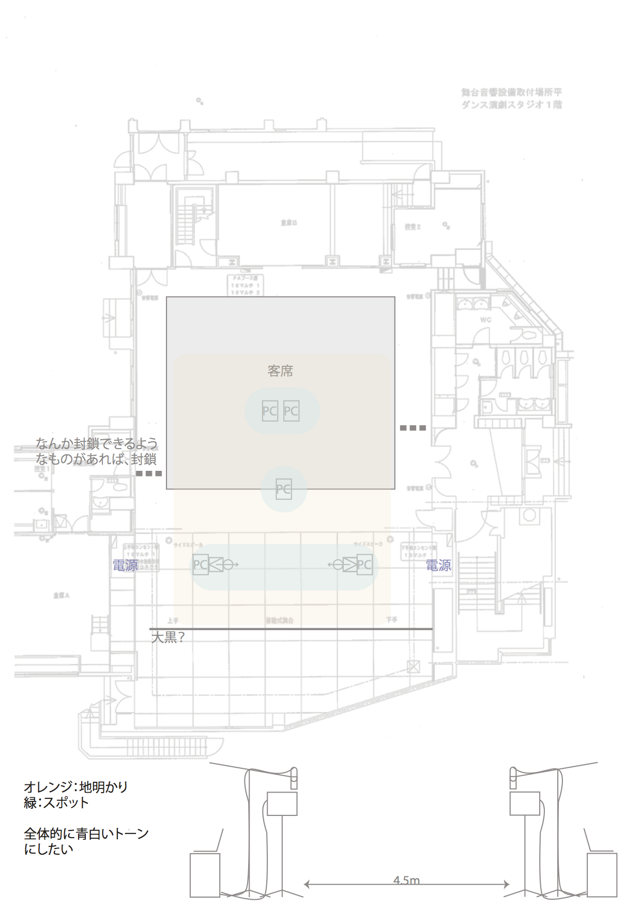

本付録資料は添付するデータDVDの内容と、再展示のための手順書から成る。

# 添付データDVDディレクトリ構成

- archive_data 記録写真、動画、展示の告知やパンフレットのデータや制作時のメモなど
    - documents パンフレットやチラシのデータなど
    - exhibition_plan 展示プラン、舞台図
    - memo_nagurigaki 展示に至るまでに作られたメモ書きの寄せ集め
    - photo 製作途中の記録写真、動画など
    - photo_noguchi 本番の記録写真
    - movie 本作の記録動画（添付記録映像DVDと同じもの）と前作《Acoustic Delay (⇔) Memory》の記録動画 
- program_source 実際に展示に使われたスクリプトなどをまとめたフォルダ
    - pc1
    - pc2
    - pc3
    - pc4_5
- readme この文章のソースフォルダ。
    - Makefile makeを使用しpdf出力が可能。要pandoc+platex 
    - md/readme.md この文章のソースファイル。
    - tex pdf出力用のtexフォルダ。
    - pdf/readme.pdf 本資料のPDFファイル。
- signal_svg Faustでの信号処理のブロックダイヤグラム画像。process.svgをWebブラウザで開くとダイヤグラムが表示される。
    - 16qam_2speaker-svg(PC1,2)
    - 16qam_mobiledecoder-svg(PC2,3)

# 《送れ｜遅れ / post｜past》展示手順

## 展示構成

### 展示会場図

{width=100%}\ 


## 前準備

添付資料内program_sourceフォルダを各PCのデスクトップにコピーする。

## PC1/2

### 使用機材

- Macbook Pro
- オーディオインターフェース
    - 中間発表展示時にはPC1にSteinberg UR28M、PC2にSteinberg MR816Xを用いた。比較的低レイテンシなものが望ましいが基本的にはファンタム電源の入る1in1out以上の入出力のあるものならなんでもよい。
- スピーカー
    - 中間発表時はマイクスタンド設置のできるEVE Audio SC204を使用した。
- マイク
    - 中間発表時はAKG P420を双指向性のモードでパッド、ローカット無しで用いた。


### ソフトウェア構成

2016年11月のソフトウェア構成

- OS
    - Mac OS X 10.8〜10.12
- ソフトウェア
    - Cycling'74 Max v.7.3.1(PC2は都合上OS10.6を利用したため、Max6 Runtimeを用いた。)
    - faustgen~ v1.10

- (以下は書き込み機能のPC2のみ) 
    - Node.js v.5.3.1
    - Google Chrome v.54
    - Safari v.9.1

### 起動手順

#### PC1,2共通(1)

1. PCを起動する。
2. オーディオインターフェースの電源を入れる。マイクのゲインを最小にし、ファンタム電源を入れる。
3. スピーカーの電源を入れる（パッシブタイプを使う場合、パワーアンプの電源を入れる）。ボリュームは最小にしておく。

#### PC1

1. pc1/16qam_2speaker.maxpatを起動する。

#### PC2

1. Google Chromeを起動する。Google Docsで任意の書類を一つ作り、公開範囲をリンクを知っている全員に設定する。
1. pc2/16qam_2speaker.maxpatを起動する。
1. Safariを起動する。
1. Safariのウィンドウが画面左半分、Google Chromeのウィンドウが右半分になるようにウィンドウの大きさを調整する。
1. pc2/server_start.commandを起動する。ターミナルが立ち上がりサーバーが起動する。（起動すると、自動で10秒間隔でGoogle ChromeとSafariがアクティブになるので操作しづらくなるので注意。）
1. SafariでURL、<http://localhost:3000/> にアクセスする。UI画面が開かれる。

#### PC1,2共通(2)

1. スピーカーのボリュームを人の話し声と同程度に上げる。
2. マイクのゲインをプリアンプでピークメーターが点灯しない程度に上げる。

### シャットダウン手順

#### PC1,2共通

1. スピーカーの電源を落とす。
2. マイクのゲインを最小にし、ファンタム電源を落とす。

#### PC1

1. Maxを終了する。

#### PC2

1. ターミナルを開きcontrol+cでサーバーを停止する。
2. Maxを終了する。
3. Safari、Google Chromeを終了する。

### 備考

16qam\_2speaker.maxpatはPC1,2共に全く同じプログラムを使用しているが、使われている設定ファイルconfig.jsonが異なる。使用するオーディオインターフェースが違う場合、一度16qam\_2speaker.maxpatを起動し、[Open Audio Setting]ボタンをクリックしオーディオ設定画面を出す。インプットとアウトプットデバイス選択欄に使いたいオーディオインターフェースの名前が表示されているはずなので、それを選択すると音が出る。ただしこの設定は保存されないので、config.jsonを編集してオーディオインターフェースの名前を書き換える必要がある。

なお、PC1はMaxとfaustgen~しか使っていないので、Windowsマシンでも構成することが可能である。PC2はGoogle ChromeとSafariの自動操作のためにMacintoshのシステムレベルAPIを呼び出しているためそのままではWindowsで動かすことは出来ない。

## PC3

### 使用機材

- Macbook Pro

### ソフトウェア構成

2016年11月のソフトウェア構成

- OS
    - Mac OS X 10.9〜10.12(sayコマンドで日本語読み上げができるようになっていること)
- ソフトウェア
    - Cycling'74 Max v.7.3.1
    - faustgen~ v1.10
    - Node.js v.5.3.1
    - Google Chrome v.54

### 起動手順

0. システム環境設定で内蔵マイクの音量を7割ほどに設定する。ノイズ除去はオフにする。
1. pc3/16qam_receiver.maxpatを起動する。
2. pc3/server_start.commandを起動する。ターミナルが起動する。
3. Google Chromeを開き、<http://localhost:3000>にアクセスする。画面を最大化する。
4. 読み上げの音量が人の話し声程度になるようスピーカーの音量を調整する。

### シャットダウン手順

1. ターミナル画面を出し、Control+cでサーバーを停止する。
2. Maxを終了する。
3. Google Chromeを終了する。

### 備考

読み上げた際に自分の声をノイズとして拾ってまた別の言葉を読み上げて暴走することがあるがこれは想定の内なので気にしなくて良い。

## PC4,5

### 使用機材

- Macbook ProもしくはMacbook Air

### ソフトウェア構成

2016年11月のソフトウェア構成

- OS
    - Mac OS X 10.9〜10.12(sayコマンドで日本語読み上げができるようになっていること)
- ソフトウェア
    - Puredata 0.47.1(パッケージマネージャdekenでggeeライブラリ、cycloneライブラリをインストールしておくこと)

### 起動手順

1. Google Chromeを立ち上げ、PC2で開いているのと同じGoogle Docsの書類を立ち上げる。
2. Google Docsのメニューバーからツール＞音声入力で音声入力パネルを立ち上げ、パネルが書類の右上、具体的にはディスプレイ左上からx方向1075ピクセル右に、y方向下に下がった位置にパネルの中央が来るように配置する。
3. ブラウザはフルスクリーンモードにする。
4. pc4_5/startup.commandを起動する。Puredataが自動的に立上がる（立ち上がらない場合、startup.commandをテキストエディタで開き、Puredataのパスがあっているか確認する。）。
5. 初回のみ、パッチ内で編集モードに入り、

```
osascript /Users/Tomoya/Desktop/post_past_data/pc4_5/singleclick.scpt $1 $2 $3
osascript /Users/Tomoya/Desktop/post_past_data/pc4_5/keyspeak.scpt

```

のTomoyaとなっている部分をPCのユーザー名に書き換え、パッチを保存する。

6. 編集モードを抜け、PuredataのDSPをオンにする。パッチの赤いボタンをクリックする。


### 備考

Puredataをシェルコマンド経由で起動しているのはシステムに置かれているPuredataの設定ファイルを読み込んで起動すると何故かDSPが暴走するため、シェルコマンドで直接設定を指定して起動するようにしている。別段この問題が発生しないのであればspeechapp.pdを直接起動して構わない。

## 信号処理に関する備考

PC3で信号を受信するために、循環している32bitの先頭が何処なのかを判別するためのパイロットトーンを15kHz、ASKで送信しているが、本文のシグナルダイヤグラムでは説明の簡略化のため省いた。

もう一つ省いてあるものとしては、Faustのシグナルダイヤグラム内にfilteringというブロックが出来ているが、これは適応フィルタの実験中のブロックで実際にはベースバンド信号での位相補償回路（これはより早い位相誤差収束のために最後に気休め程度に付けたので、本文でのシグナルからは省かせてもらった）以外はバイパスされている。現在も16qam.lib中のグローバル変数ff_tapsやfb_tapsを変更することで適応フィルタを採用することは可能である（ただしフィルタのタップ数分の遅延が発生する）。

また、Faustで出力されたSVGダイヤグラムではビット判定が冗長な記述になっているが、これは当初QPSKではなく1シンボルに4bitを割り当てる16QAMという方式を採用していたがデータのエラーを少なくするため途中からQPSKに変更されたことの名残である(ファイル名が16qam~となっているのもそれが理由である)。16QAMのビット判定モジュールは16qam.libの中に記述してあるので必要に応じて差し替えることも可能である。

